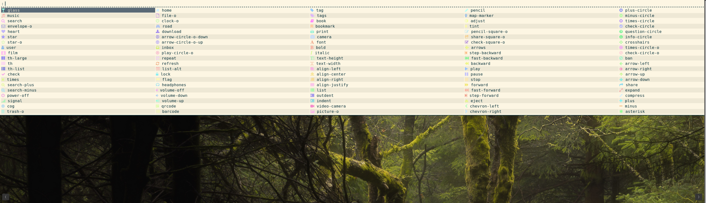

Search an font awesome icon by name and copy it to the clipboard. Works best with a dmenu variant that does fuzzy search such as rofi, but it's compatible with plain dmenu.

If possible, it also sends a desktop notification for better user feedback.



## Usage with i3
Clone the repo. Assign a keystroke in your i3 configuration:

```
# ~/.config/i3/config

bindsym $mod+quotedbl exec path/to/dmenu-fontawesome
```

## Similar scripts

* [dmenu-emoji](https://github.com/porras/dmenu-emoji). Search an emoji by name and copy it to the clipboard.
* [emoji.sh](https://gist.github.com/markmandel/546fc099590f1c08fa936795ac9da143). One liner, requests emojis each time, no autocomplete
* [rofimoji](https://github.com/fdw/rofimoji). Python-based, rofi only, can insert directly instead of copy&paste
* [emoji-rofi-menu](https://github.com/rob-a-bolton/emoji-rofi-menu). Rofi only, can insert directly
* [rofi-emoji](https://github.com/hatzel/rofi-emoji/). Python-based (but generates a bash script so Python is not used each time), rofi only, inserts-directly
